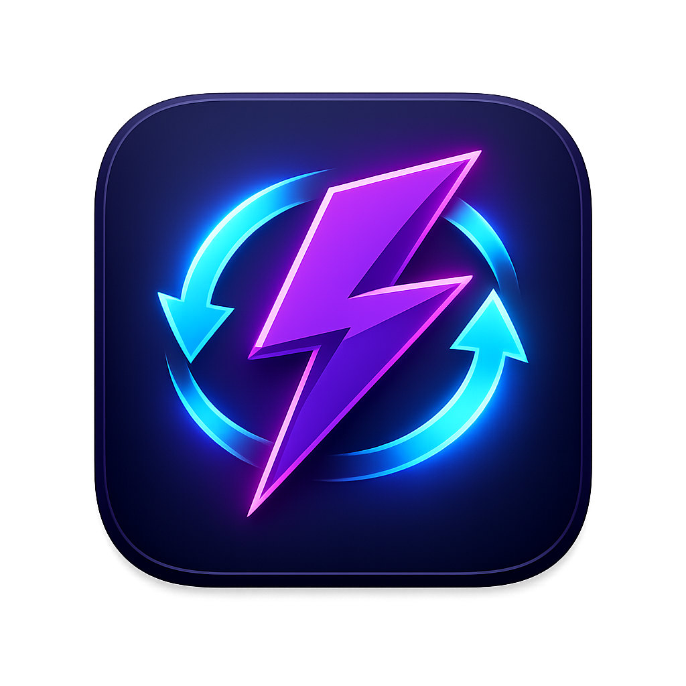

# VibeSync

### Local coding agent context handoff for Claude Code, Codex, Antigravity CLI, and OpenCode

VibeSync is a macOS menu bar app that helps local coding agents take over work from each other without relying on lossy summaries. It indexes local session transcripts, detects the coding agent running in your focused terminal, and copies a takeover prompt that points the next agent to the original workspace and transcript.

> VibeSync is local-first. It reads session files from your machine, runs a backend on `127.0.0.1`, and does not upload transcripts to a cloud service.

English | [Code of Conduct](CODE_OF_CONDUCT.md) | [Security](SECURITY.md) | [MIT License](LICENSE)

---

## Highlights

- **Terminal-aware takeover hotkey**: Press `Cmd + Shift + C` to copy the takeover prompt for the supported coding agent running in the currently focused terminal.
- **Four-agent session index**: Browse Claude Code, Codex, Antigravity CLI, and OpenCode sessions from one local dashboard.
- **Transcript path handoff**: Hand off the exact source transcript path instead of a compressed summary.
- **Manual session picker**: Search, filter by agent, inspect session details, and copy a takeover prompt from the menu bar dashboard.
- **Workspace intelligence**: Includes git branch, git status, command hints, touched files, and a conversation preview.
- **Fail-closed clipboard behavior**: If VibeSync cannot prove the focused context, it shows an error and does not copy a guessed latest session.
- **Native macOS menu bar app**: Electron shell with a zero-dependency Python backend bundled into the desktop app.

## Preview



## Supported Tools

### Coding Agents

- Claude Code
- Codex
- Antigravity CLI
- OpenCode

### Terminal And IDE Hosts

- Ghostty
- iTerm2
- Terminal.app
- VS Code integrated terminal
- Cursor integrated terminal
- Windsurf integrated terminal
- JetBrains IDE terminals

> IDE terminal detection is best-effort and may require macOS Accessibility permission for stronger workspace disambiguation.

## Quick Start

### Basic Workflow

1. Work in a supported terminal with Claude Code, Codex, Antigravity CLI, or OpenCode.
2. Press `Cmd + Shift + C`.
3. VibeSync detects the focused host, working directory, and active agent command.
4. If a matching local session is found, VibeSync copies a takeover prompt.
5. Paste the prompt into another local coding agent to continue from the original transcript and workspace.

The takeover prompt includes:

- Source agent and session id
- Workspace path
- Source transcript path
- Active git branch
- Current git status when available
- A reading protocol for reconstructing the handoff context safely

### Manual Picker

Click the VibeSync menu bar icon to open Session Manager.

- Filter sessions by agent
- Search by title, project path, session id, or agent
- Inspect transcript path, workspace path, commands, touched files, and conversation preview
- Copy the full takeover prompt or transcript path

## Download And Installation

### System Requirements

- macOS 12 Monterey or later
- Python 3 available as `python3`
- Local session history from at least one supported coding agent

### Install From Releases

1. Download the latest `VibeSync-v{version}-macOS.zip` from the Releases page.
2. Unzip the archive.
3. Move `VibeSync.app` to `/Applications`.
4. Launch VibeSync.
5. If macOS blocks the first launch, open **System Settings -> Privacy & Security** and allow the app.

VibeSync runs as a menu bar app and hides the Dock icon. Click the menu bar icon to open the Session Manager.

### Permissions

VibeSync may need the following macOS permissions depending on your workflow:

- **Notifications**: Used to report hotkey success or failure.
- **Accessibility**: Helps detect focused terminal or IDE context in some hosts.
- **Global shortcut availability**: `Cmd + Shift + C` must not be reserved by another app.

## Development

### Repository Layout

```text
backend/
  app.py              Local HTTP API on 127.0.0.1
  parser.py           Session discovery, transcript parsing, takeover prompt generation
  tests/              Python unit tests

frontend/
  main-electron.cjs   Menu bar app, backend lifecycle, global hotkey
  terminal-context.cjs
  hotkey-sync.cjs
  src/                React Session Manager UI
  tests/              Node test runner tests
```

### Run In Development

Install frontend dependencies:

```bash
cd frontend
npm install
```

Start the desktop app with hot reload:

```bash
cd frontend
npm run desktop
```

In development mode, Electron starts the Python backend automatically and loads Vite from `http://localhost:5173`.

You can also run the backend directly:

```bash
python3 backend/app.py
```

The backend listens on `http://127.0.0.1:8765` by default.

### Build A Packaged App

```bash
cd frontend
npm run build:desktop
```

Create a macOS zip release artifact:

```bash
cd frontend
npm run package:zip
```

### Tests And Checks

Frontend:

```bash
cd frontend
npm run lint
npm run test
npm run build
```

Backend:

```bash
python3 -m unittest discover backend/tests
```

Hotkey diagnostics:

```bash
cd frontend
npm run diagnose:hotkey
```

Add `-- --copy` to write the resolved takeover prompt to the clipboard through the same flow used by the global hotkey.

## Architecture

```text
+------------------------------ macOS Menu Bar -------------------------------+
|                                                                             |
|  +----------------------+          +--------------------------------------+ |
|  | Electron Main Process|          | React Session Manager                | |
|  | - tray/menu          |<-- IPC ->| - search/filter sessions             | |
|  | - global shortcut    |          | - inspect details                    | |
|  | - backend lifecycle  |          | - copy takeover prompts              | |
|  +----------+-----------+          +--------------------------------------+ |
|             |                                                               |
|             v HTTP on 127.0.0.1                                             |
|  +------------------------------------------------------------------------+ |
|  | Python Backend                                                         | |
|  | - local session discovery                                              | |
|  | - transcript parsing                                                   | |
|  | - git status hints                                                     | |
|  | - context-aware takeover resolution                                    | |
|  +----------+-------------------------------------------------------------+ |
|             |                                                               |
|             v                                                               |
|  ~/.claude      ~/.codex      ~/.gemini/antigravity-cli      ~/.local/share |
|  Claude Code    Codex       Antigravity CLI                  OpenCode       |
|                                                                             |
+-----------------------------------------------------------------------------+
```

### Core Design Principles

- **Local source of truth**: VibeSync points to original local transcripts instead of storing cloud handoff state.
- **Agent-scoped matching**: The hotkey resolves sessions only for the detected active agent.
- **Workspace-aware matching**: The focused terminal cwd is used to avoid copying unrelated sessions.
- **Fail closed**: Ambiguous, missing, or unsupported contexts produce an error instead of a best guess.
- **Small backend surface**: The Python API binds to `127.0.0.1` and exposes only local session and takeover endpoints.

### API Endpoints

- `GET /api/health`
- `GET /api/sessions`
- `GET /api/sessions?cwd=/path/to/workspace`
- `GET /api/sessions/{agent}/{session_id}`
- `GET /api/workspace?path=/path/to/workspace`
- `POST /api/takeover/resolve`

## Troubleshooting

### The Hotkey Does Nothing

- Confirm VibeSync is running in the menu bar.
- Check whether another app already owns `Cmd + Shift + C`.
- Open the menu bar dashboard and use **Detect Current Terminal** to inspect the detected host, cwd, and command.

### No Matching Session Found

- Make sure the focused terminal is inside the same workspace used by the source coding agent session.
- Confirm the active command is one of `claude`, `codex`, `antigravity`, or `opencode`.
- Use the manual Session Manager picker if the session exists but cannot be resolved from the focused terminal.

### Backend Connection Lost

- VibeSync starts the backend automatically.
- If port `8765` is occupied, the packaged app tries the next available port up to `8770`.
- In development, stop stale Vite or backend processes before restarting:

```bash
lsof -nP -iTCP:5173 -sTCP:LISTEN
lsof -nP -iTCP:8765 -sTCP:LISTEN
```

### IDE Detection Is Incomplete

Grant Accessibility permission to VibeSync in **System Settings -> Privacy & Security -> Accessibility**, then restart the app.

## Privacy And Security

- VibeSync reads local coding-agent session files from your home directory.
- The backend binds to `127.0.0.1` and is intended for local desktop use only.
- Takeover prompts contain local filesystem paths and may include git status snippets.
- VibeSync does not intentionally upload transcripts, prompts, or workspace data.
- Do not paste takeover prompts into untrusted remote services if the transcript path or git status is sensitive.

For vulnerability reports, see [SECURITY.md](SECURITY.md).

## Contributing

Issues and pull requests are welcome.

Before submitting a PR, please run:

```bash
cd frontend
npm run lint
npm run test
npm run build
cd ..
python3 -m unittest discover backend/tests
```

For larger features, open an issue first so the behavior and safety model can be discussed before implementation.

## License

MIT (c) VibeSync contributors
